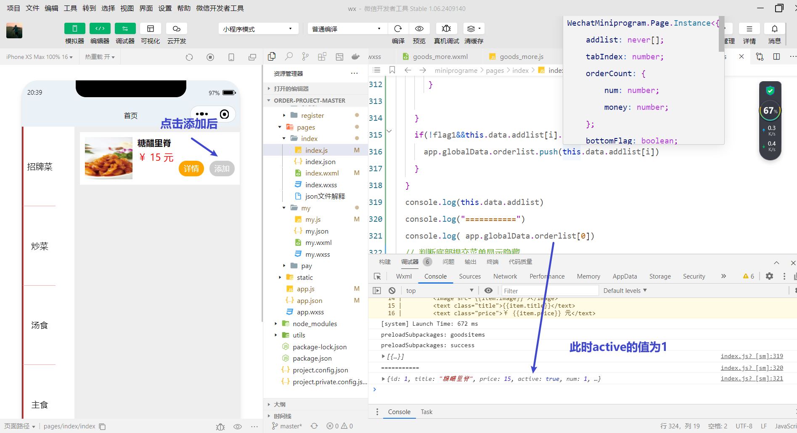
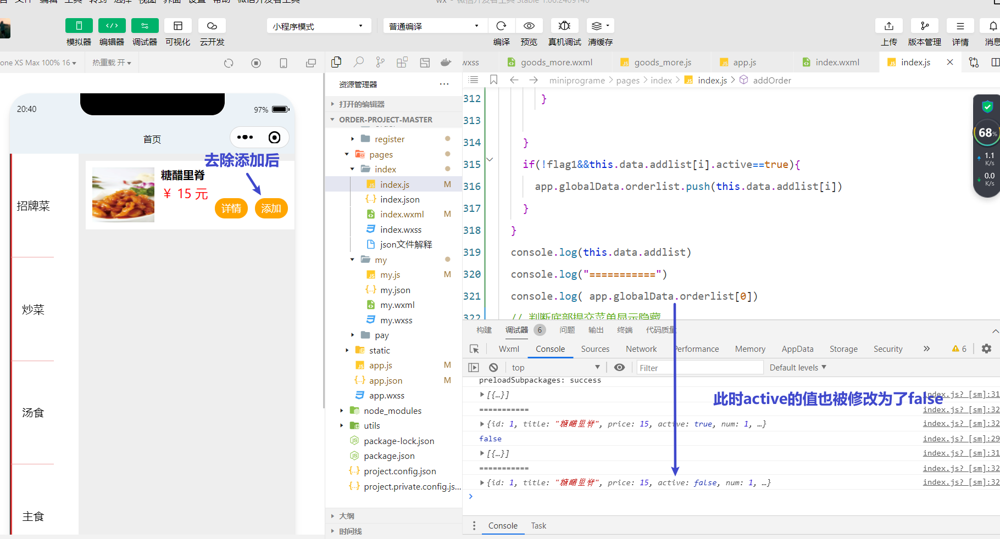
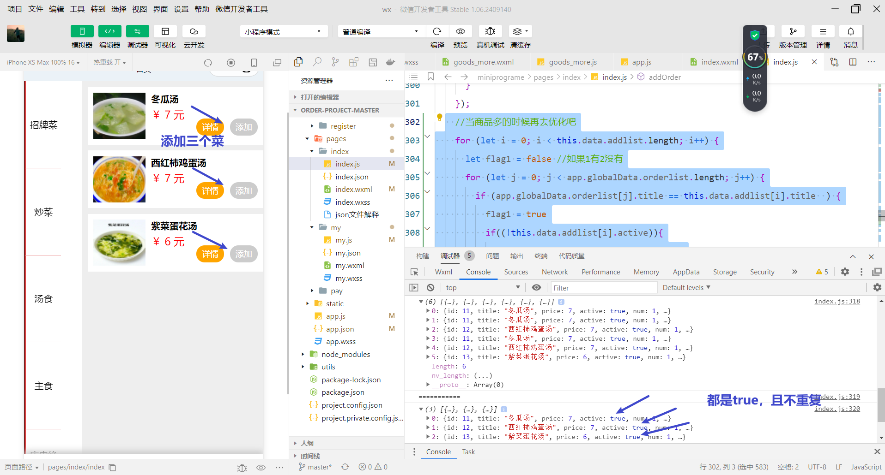
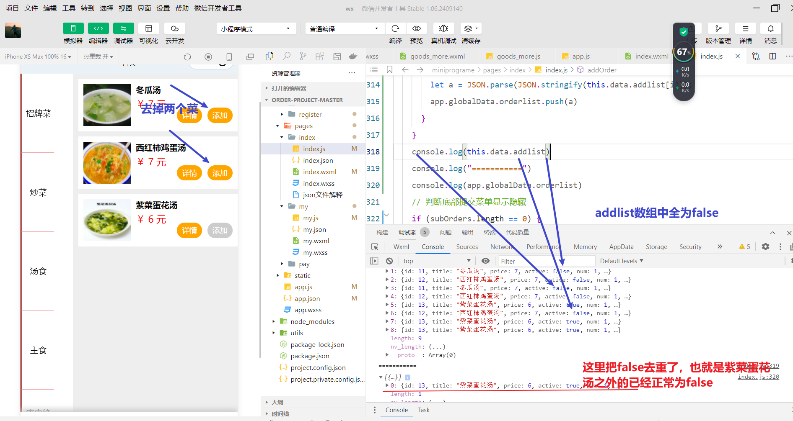

# 页面更新各数组间没有独立性

```javascript
addOrder: function(event) {
  let that = this;
  let id = event.target.dataset.id;
  let index = event.target.dataset.index;
  let param = this.data.items[index];
  let subOrders = []; // 购物单列表存储数据
  let app=getApp()
  param.active ? param.active = false : param.active = true;
  // 改变添加按钮的状态
  this.data.items.splice(index, 1, param);//用更新后的param来代替原来的param
  if(app.globalData.orderlist[0])
  console.log(app.globalData.orderlist[0].active)
  that.setData({
    items: this.data.items
  });
  // 将已经确定的菜单添加到购物单列表
  this.data.items.forEach(item => {
    if (item.active) {
      subOrders.push(item);
      this.data.addlist.push(item)
    }
  });
  //当商品多的时候再去优化吧
  for (let i = 0; i< this.data.addlist.length; i++) {
    let flag1 =false //如果1有2没有
    for (let j  = 0; j < app.globalData.orderlist.length; j++) {
       if(app.globalData.orderlist[j]==this.data.addlist[i]){
         flag1=true 
         break;
       }
       if(app.globalData.orderlist[j].title==this.data.addlist[i].title&&(!this.data.addlist[i].active)){
        app.globalData.orderlist.splice(j,1)
       }
       
    }  
    if(!flag1&&this.data.addlist[i].active==true){
      app.globalData.orderlist.push(this.data.addlist[i])
    }
  }
}
```

本来我想的是用`addlist` 当堆栈，无论`active`为1或0都往里面存，然后把`app.globalData.orderlist`和`this.data.addlist`作比较，去除`app.globalData.orderlist`中`active`为`false`的，存入`app.globalData.orderlist`没有但是`this.data.addlist`有（新增）的且`active`为1的。

Debug中发现，改变`this.data.addlist`中active的同时`app.globalData.orderlist`的`active`也会跟着改变





## 原因分析

在JavaScript中，对象和数组是通过引用来传递的。这意味着当你将一个对象或数组赋值给另一个变量时，你实际上是在复制一个指向原始数据的引用，而不是数据本身。因此，如果你修改了通过引用传递的对象或数组的内容，那么所有引用该对象或数组的变量都会看到这些更改。

在代码中，问题可能出现在你如何处理 `this.data.addlist` 和 `app.globalData.orderlist`。如果你从 `app.globalData.orderlist` 中复制了一个对象到 `this.data.addlist`，那么这两个列表中的对象实际上是同一个对象的引用。因此，当你修改 `this.data.addlist` 中某个对象的 `active` 属性时，`app.globalData.orderlist` 中相应对象的 `active` 属性被修改。

## 解决方法

为了解决这个问题，你需要确保在将对象从一个列表复制到另一个列表时，创建对象的深拷贝。深拷贝意味着创建一个全新的对象，其属性值是原始对象属性值的副本（对于嵌套的对象和数组，也需要递归地进行深拷贝）。

`JSON.stringify()` 和 `JSON.parse()` 是一种常见的实现深拷贝的简单方式，但它有一些局限性。

* 无法处理函数、`undefined`、`Symbol` 等特殊类型。
* 不能拷贝对象的原型链和循环引用对象。

```javascript
let obj2 = JSON.parse(JSON.stringify(obj1)); // 深拷贝
```

## 结果演示

修改之后的代码

```javascript
  //当商品多的时候再去优化吧
    for (let i = 0; i < this.data.addlist.length; i++) {
      let flag1 = false //如果1有2没有
      for (let j = 0; j < app.globalData.orderlist.length; j++) {
        if (app.globalData.orderlist[j].title == this.data.addlist[i].title  ) {
          flag1 = true
          if((!this.data.addlist[i].active)){
            app.globalData.orderlist.splice(j, 1)
          }
        }
      }
      if (!flag1 && this.data.addlist[i].active == true) {
        let a = JSON.parse(JSON.stringify(this.data.addlist[i]));
        app.globalData.orderlist.push(a)
      }
    }
```





## 注意

这个错误不叫错误，不独立可以巧妙的影响全局的值，有时候也会很方便比如两个页面传递的时候，页面B给页面A传入了一个实体类H，H在页面A的方法a，b都有设计，要想让A在a方法和b方法都能影响到就要用不独立的方法。

# 删除数组中某一个元素的实现方法

```javascript
app.globalData.orderlist.splice(i,j) 
i为索引值，j为从这个位置开始要删除的元素个数
```

```
  let goods= wx.getStorageSync("suborders")
    let somdata={
      id:'',
      index:''
    }
    for (let index = 0; index < this.data.items.length; index++) {
      if(this.data.items[index].title==goods.title){
        somData.id=goods.id;
        somData.index=index
      }
    }
    let mockEvent = {
      target: {
        dataset: {
          id: somData.id,
          index: somData.index
        }
      }
    };
    this.addOrder(mockEvent)

```

