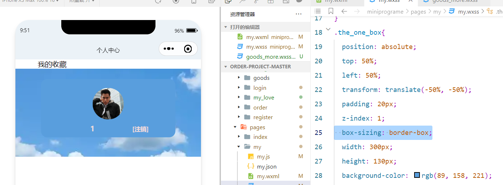
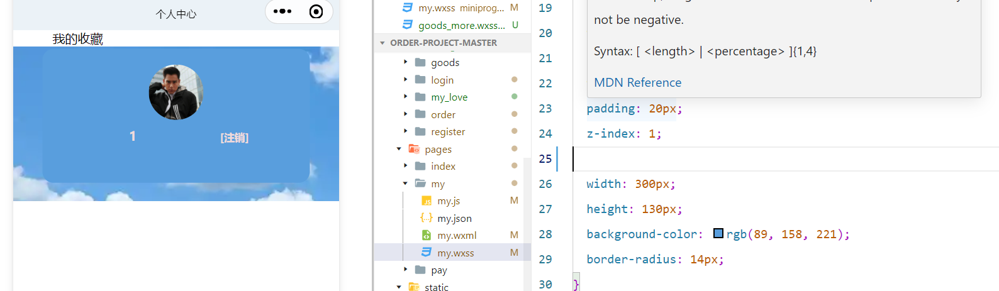
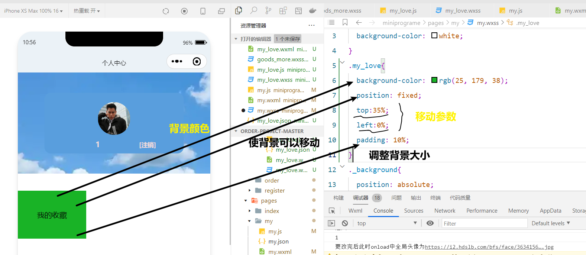
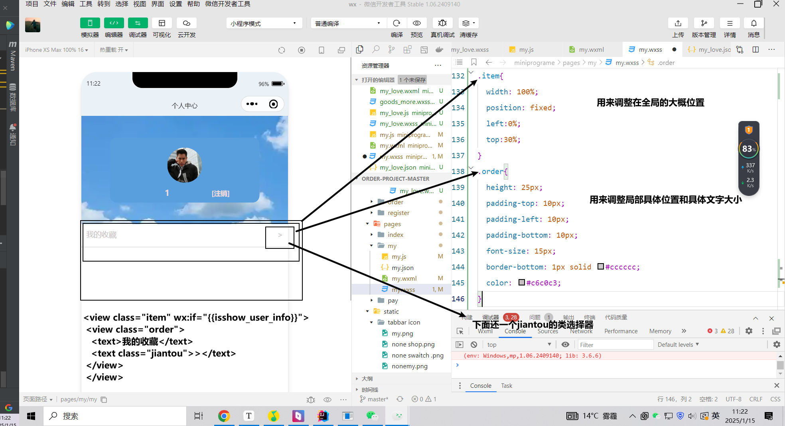

# 设置文本超过长度自动隐藏（用于名称设置）

```css
.ellipsis-text {
  width: 100%; /* 或者设置一个具体的宽度值 */
  white-space: nowrap; /* 禁止文本换行 */
  overflow: hidden; /* 隐藏超出容器的部分 */
  text-overflow: ellipsis; /* 显示省略号 */
  display: inline-block; /* 确保文本在行内块级元素中显示 */
}
```

# 设置背景图片

```css
._background{
  position: absolute;
  top: 0;
  left: 0;
  width: 100%;
  height: 30%; /* 背景图片占据屏幕高度的30% */
  z-index: -1; /* 确保背景图片在内容下面 */
  background-image: url('https://img0.baidu.com/it/u=2602903116,45962552&fm=253&fmt=auto&app=120&f=JPEG?w=654&h=368'); /* 背景图片路径，注意相对路径的写法 */
}
```

# 更容易控制盒子改变padding时的位置

```css
  box-sizing: border-box;
```

`box-sizing: border-box;` 是CSS中的一个属性值设置，它用于改变元素盒模型的计算方式。在标准的盒模型中（即 `content-box`，这是默认值），元素的宽度和高度只包括内容区域，不包括边框（border）、内边距（padding）和外边距（margin）。这意味着，如果你为一个元素设置了宽度和高度，并添加了边框和内边距，元素的总尺寸会超过你设置的宽度和高度。

然而，当你将 `box-sizing` 设置为 `border-box` 时，元素的宽度和高度将包括内容、边框和内边距。这意味着，无论边框和内边距的大小如何，元素的总尺寸将始终等于你设置的宽度和高度。这对于布局和响应式设计非常有用，因为它允许你更容易地控制元素的尺寸，而不用担心边框和内边距对元素总尺寸的影响。

```css
 .box {
    width: 200px;
    height: 100px;
    padding: 20px;
    border: 10px solid black;
    box-sizing: border-box; /* 这将确保元素的宽度和高度包括边框和内边距 */
  }
```

在这个例子中，尽管我们为 `.box` 元素添加了20像素的内边距和10像素的边框，但元素的总宽度仍然是200像素，总高度仍然是100像素。这是因为 `box-sizing: border-box;` 使得元素的宽度和高度包括了内容、边框和内边距。如果你将 `box-sizing` 改为 `content-box`（或者删除这一行，因为 `content-box` 是默认值），那么元素的总宽度将变为240像素（200px宽度 + 20px左内边距 + 20px右内边距），总高度将变为140像素（100px高度 + 20px上内边距 + 20px下内边距），因为边框的宽度也会加到总尺寸上。



若删除这一行



# CSS：一个盒子位置嵌套参数

## Position

```html
定位使用position进行操作-->
posting包括四个参数 static,fixed relative absolute-->默认为static,表示不进行位移
fixed,表示相对于浏览器窗口进行定位
relative,表示相对于当前位置进行定位
absolute,相对于上级第一个部位static值的元素进行定位:如果不存在这样的元素,就相对于bodv元素定位
当元素设置定位时,可以使用left right top bottom 四个属性设定定位元素位移
left,表示定位元素左边框与参照元素左边框的间距
right,表示定位元素右边框与参照元素右边框的间距top,表示定位元素上边框与参照元素上边框的间距bottom,表示定位元素下边框与参照元素下边框的间距通过z-index属性可以设置定位元素的显示顺序,数值越大,排列的位置越靠前-->
```

## 综合案例

### 全局盒子大概位置



### 添加一个局部嵌套进全局盒子的具体样式



# 设置背景透明度

## 让整个窗口全部受影响

```css
filter:alpha(opacity=50);  /*支持 IE 浏览器*/
-moz-opacity:0.50; /*支持 FireFox 浏览器*/
opacity:0.50;  /*支持 Chrome, Opera, Safari 等浏览器*/
```

## 只让背景受影响

后面的0.2为透明度

```css
 background: rgba(255,204,51, 0.2) 
```

